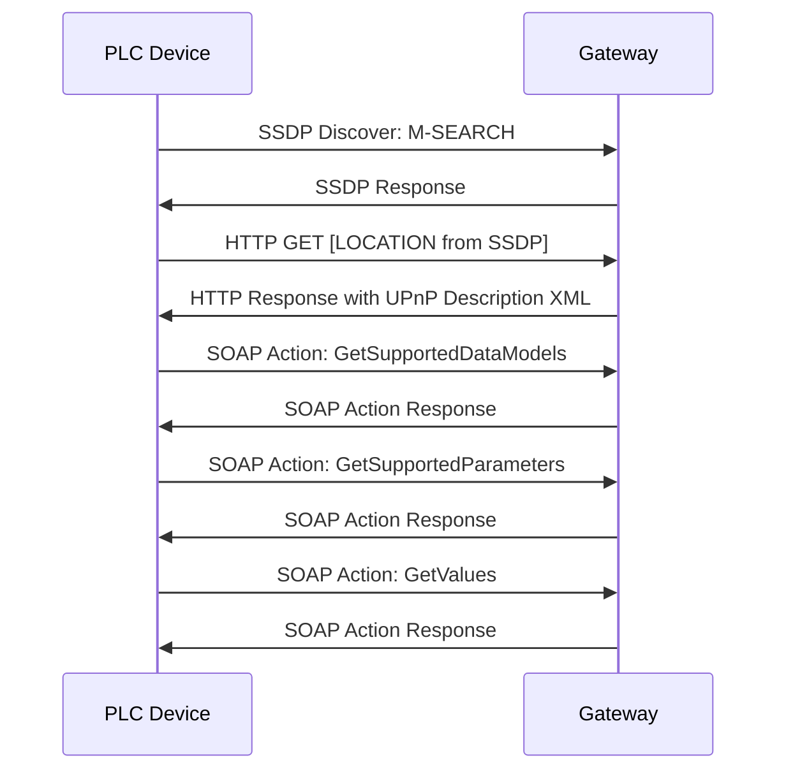

# VDSL Performer - Guideline for the implementation on Gateways
This guideline defines the communication needs between xDSL Customer Premises Equipment (CPE) and Powerline Communication (PLC) devices to implement an automatic mitigation of interference of PLC on DSL. The mitigation algorithm is also known as Dynamic Interference Mitigation (DIM).

  - [Abbreviations](#abbreviations)
  - [References](#references)
  - [Introduction](#introduction)
  - [Gateway discovery](#gateway-discovery)
    - [SSDP discovery](#ssdp-discovery)
    - [UPnP description](#upnp-description)
    - [Data model discovery](#data-model-discovery)
    - [Supported parameters](#supported-parameters)
    - [Get Values](#get-values)
  - [Relevant TR-181 data model parameters](#relevant-tr-181-data-model-parameters)

## Abbreviations

- **BBF** Broadband Forum
- **CMS:2** ConfigurationManagement service defined by UPnP Forum in UPnP DM CMS:2
- **CPE** Customer Premises Equipment
- **DSL** Digital Subscriber Line
- **CM** Configuration Management
- **DM** Device Management
- **PLC** Powerline Communication
- **SNR** Signal-to-noise ratio
- **SOAP** Simple Object Access Protocol
- **SSDP** Simple Service Discovery Protocol
- **ST** Search Topic used in SSDP
- **UPnP UDA** UPnP Device Architecture

## References
- [G.997.1 (11/16)](https://www.itu.int/rec/dologin_pub.asp?lang=e&id=T-REC-G.997.1-201611-S!!PDF-E&type=items)
- [RFC 2616 HTTP/1.1](https://datatracker.ietf.org/doc/html/rfc2616)
- [TR-064 Issue 2](https://www.broadband-forum.org/download/TR-064_Issue-2.pdf)
- [TR-181 Issue 2](https://www.broadband-forum.org/technical/download/TR-181_Issue-2.pdf)
- [UPnP DM Configuration Management v2](https://www.upnp.org/specs/dm/UPnP-dm-ConfigurationManagement-v2-Service.pdf)
- [UPnP Device Architecture 2.0](https://openconnectivity.org/upnp-specs/UPnP-arch-DeviceArchitecture-v2.0-20200417.pdf)

## Introduction
The VDSL performer algorithm aims to eliminate the impact of PLC on the DSL connection while keeping the best PLC performance by adjusting dynamically the PLC transmission power based on measured disturbances of the DSL SNR. Therefore, it requires knowledge of the DSL SNR. This can be acquired by finding the connected DSL gateway and then requesting the DSL SNR from this gateway.

Since the PLC device starts with a power mask which already decreases the power at certain frequencies depending on the DSL profile (e.g., 17a, 35b), it might happen that the VDSL performer algorithm also increases power at these frequencies where it does not interfere with DSL, while it may further decrease the power mask at frequencies where the DSL signal may still be disturbed.

To find the suitable gateway device, the mechanism defined in "UPnP DM CMS Discovering of the Data Model" are used. The messages exchanged are defined in "UPnP Device Architecture 2.0".

The following chapters will provide some hints about implementation details which are important to provide a compatible gateway.

## Gateway discovery
The discovery of the gateway device takes place in five steps:
1. SSDP discovery: Find devices supporting UPnP DM CMS service
2. UPnP description: Extract the control URL of the CMS service
3. Data model discovery: Determine the prefix used for the TR-181 data model
4. GetSupportedParameters: Check if all necessary parameters are supported
5. GetValue: Check for an active DSL link

The following graph visualizes these five steps.

The first two steps are based on the discovery process defined in UDA 2.0, while the steps three and four are defined in UPnP DM CMS v2 chapter *Discovering of the Data Model*. The fifth step is used to make sure that the found gateway is the one providing the DSL link.

In the first step, the SSDP discovery may return a list of multiple devices including the gateway device. The subsequent steps filter out devices that are not the gateway device or don't provide all necessary information for the VDSL performer algorithm.

The process is repeated if no compatible gateway could be found with an exponential backoff time between the retries.

The individual steps are explained in more detail below.

### SSDP Discovery
SSDP is used as defined in UDA 2.0 with the ST `urn:schemas-upnp-org:service:ConfigurationManagement:2` defined in UPnP DM CMS. It is used to discover devices supporting the CM service mentioned above.

The devolo PLC device sends the following packet to initiate the SSDP discovery:

    M-SEARCH * HTTP/1.1
    HOST: 239.255.255.250:1900
    MAN: "ssdp:discover"
    MX: 5
    ST: urn:schemas-upnp-org:service:ConfigurationManagement:2
    USER-AGENT: Spirit/<firware version> UPnP/2.0 devolo_Magic/1.0
    

The expected response has the following form:

    HTTP/1.1 200 OK
    CACHE-CONTROL: <max-age = seconds until advertisement expires>
    DATE: <datetime when response was generated>
    EXT:
    LOCATION: <URL for UPnP description for root device>
    SERVER: <OS>/<version> UPnP/2.0 <product>/<version>
    ST: urn:schemas-upnp-org:service:ConfigurationManagement:2
    USN: <composite identifier for the advertisement>
    

The devolo PLC device evaluates only the ST and LOCATION header field. The LOCATION field must contain the URL from where to fetch the UPnP description XML file, which is necessary for the next step.

### UPnP description
This step is used to determine the URL where the CM service can be reached. It is defined in UDA 2.0 *Device description*.

The UPnP description must be a valid XML document and defines a root device and optionally logical devices embedded in this root device. The root device lists its services in the *serviceList*. Any embedded logical devices can list their services in their own *serviceList*.

The devolo PLC device will search for services with the *serviceType* `urn:schemas-upnp-org:service:ConfigurationManagement:2` in the *serviceList* of the root device and in all logical devices. For services matching this *serviceType*, it will extract the *controlURL* to use for subsequent SOAP calls. The *controlURL* specifies the path where this service can be reached for control actions. The *controlURL* is usually relative to the URL at which the device description is located. It may be an absolute URL including address and port, which enables the gateway to provide the service on another port than the UPnP description.

The devolo PLC device evaluates only *serviceType* and the *controlURL* from the XML *service* fragment.

    <service>
        <serviceType>urn:schemas-upnp-org:service:ConfigurationManagement:2</serviceType>
        <serviceId><!-- The urn:upnp-org:serviceId serviceId --> </serviceId>
        <SCPDURL> <!-- not considered --> </SCPDURL>
        <controlURL>URL for control</controlURL>
        <eventSubURL> <!-- not considered --> </eventSubURL>
    </service>

### Data model discovery
This step is used to determine the prefix of the mapping of the TR-181 parameters to UPnP DM names (*Data Model Location*). It defaults to `/BBF/` as defined in UPnP DM CMS Appendix C *BBF (TR-069) Mapping Rules*. The SOAP action *GetSupportedDataModels* is used to determine the prefix.

The PLC device sends the following request.

    POST path of control URL HTTP/1.1
    HOST: hostname:portNumber
    CONTENT-LENGTH: bytes in body
    CONTENT-TYPE: text/xml; charset="utf-8"
    USER-AGENT: Spirit/<firware version> UPnP/2.0 devolo_Magic/1.0
    SOAPACTION: "urn:schemas-upnp-org:service:ConfigurationManagement:2#GetSupportedDataModels"

    <?xml version="1.0"?>
    <s:Envelope xmlns:s="http://schemas.xmlsoap.org/soap/envelope/" s:encodingStyle="http://schemas.xmlsoap.org/soap/encoding/">
        <s:Body>
            <cms:GetSupportedDataModels xmlns:cms="urn:schemas-upnp-org:dm:cms">
            </cms:GetSupportedDataModels>
        </s:Body>
    </s:Envelope>

For the gateway, there are two ways to respond to this:
- Respond with a valid XML containing the necessary information
  - PLC device will search in the *SubTrees* for the TR-181 URI checking for TR-181 issue 2 or newer
  - PLC device will use the path mentioned in *Location* as prefix for the parameters
- Respond with an HTTP error code 500 and SOAP Error 401
  - PLC Device will use the default prefix
  - PLC device will only evaluate the HTTP error code

A valid response could look like this:

    HTTP/1.0 200 OK
    CONTENT-TYPE: text/xml; charset="utf-8"
    DATE: when response was generated
    SERVER: OS/version UPnP/2.0 product/version
    CONTENT-LENGTH: bytes in body

    <?xml version="1.0"?>
    <s:Envelope
    xmlns:s="http://schemas.xmlsoap.org/soap/envelope/"
    s:encodingStyle="http://schemas.xmlsoap.org/soap/encoding/">
        <s:Body>
            <u:GetSupportedDataModelsResponse xmlns:u="urn:schemas-upnp-org:service:ConfigurationManagement:2">
                <cms:SupportedDataModels xmlns:cms="urn:schemas-upnp-org:dm:cms">
                    <SubTree>
                        <URI>urn:broadband-forum-org:tr-181-2-0</URI>
                        <Location>/BBF/</Location>
                        <URL>https://cwmp-data-models.broadband-forum.org/tr-181-2-0-0.xml</URL>
                        <Description>TR-181</Description>
                    </SubTree>
                </cms:SupportedDataModels>
            </u:GetSupportedDataModelsResponse>
        </s:Body>
    </s:Envelope>

The names of the XML namespaces can vary and be defined at different levels.

The rules mentioned in UPnP DM CMS Appendix C *BBF (TR-069) Mapping Rules* must be followed, like replacing dots by slashes, removing *Device*, and starting indexing at 0 instead of 1, e.g.:

- Device.DSL.Line.1.TestParams.SNRpsds &#8594; /BBF/DSL/Line/0/TestParams/SNRpsds

### Supported Parameters
This step is used to figure out if the devices found support all required parameters. For this, the SOAP action *GetSupportedParameters* is used.

The PLC device sends the following request to query the parameters `/BBF/DSL/Line/#/` and `/BBF/DSL/Channel/#/`

    POST path of controlURL HTTP/1.1
    HOST: hostname:portNumber
    CONTENT-LENGTH: bytes in body
    CONTENT-TYPE: text/xml; charset="utf-8"
    USER-AGENT: OS/version UPnP/2.0 product/version
    SOAPACTION: "urn:schemas-upnp-org:service:ConfigurationManagement:2#GetSupportedParameters"

    <?xml version="1.0"?>
    <s:Envelope xmlns:s="http://schemas.xmlsoap.org/soap/envelope/" s:encodingStyle="http://schemas.xmlsoap.org/soap/encoding/">
        <s:Body>
            <u:GetSupportedParameters xmlns:u="urn:schemas-upnp-org:service:ConfigurationManagement:2" xmlns:cms="urn:schemas-upnp-org:dm:cms">
                <Parameters>
                    <StartingNode>
                        <cms:StructurePathList>
                            <StructurePath>
                                /BBF/DSL/Line/#/
                            </StructurePath>
                            <StructurePath>
                                /BBF/DSL/Channel/#/
                            </StructurePath>
                        </cms:StructurePathList>
                    </StartingNode>
                    <SearchDepth>0</SearchDepth>
                </Parameters>
            </u:GetSupportedParameters>
        </s:Body>
    </s:Envelope>

The gateway must respond with all parameters that belong to the structure paths mentioned in the request.

The response of the gateway can look like this:

    HTTP/1.0 200 OK
    CONTENT-TYPE: text/xml; charset="utf-8"
    DATE: when response was generated
    SERVER: OS/version UPnP/2.0 product/version
    CONTENT-LENGTH: bytes in body

    <?xml version="1.0"?>
    <s:Envelope xmlns:s="http://schemas.xmlsoap.org/soap/envelope/" s:encodingStyle="http://schemas.xmlsoap.org/soap/encoding/">
        <s:Body>
            <u:GetSupportedParametersResponse xmlns:u="urn:schemas-upnp-org:service:ConfigurationManagement:2">
                <cms:Result xmlns:cms="urn:schemas-upnp-org:dm:cms">
                    <cms:StructurePathList>
                        <StructurePath>
                            /BBF/DSL/Channel/0/DownstreamCurrRate
                        </StructurePath>
                        <StructurePath>
                            /BBF/DSL/Channel/0/UpstreamCurrRate
                        </StructurePath>
                        ...
                    </cms:StructurePathList>
                </cms:Result>
            </u:GetSupportedParametersResponse>
        </s:Body>
    </s:Envelope>

The relevant parameters are mentioned in chapter [Relevant TR-181 data model parameters](#required-tr-181-data-model-parameters) and marked as required or optional.

### Get Values
The last step of the process is to check if the found gateway has a valid DSL link. For this, the SOAP action *GetValues* defined in UPnP DM CMS is used.

The PLC device will request the values using the following request.

    POST path of control URL HTTP/1.1
    HOST: hostname:portNumber
    CONTENT-LENGTH: bytes in body
    CONTENT-TYPE: text/xml; charset="utf-8"
    USER-AGENT: OS/version UPnP/2.0 product/version
    SOAPACTION: "urn:schemas-upnp-org:service:ConfigurationManagement:2#GetValues"

    <?xml version="1.0"?>
    <s:Envelope xmlns:s="http://schemas.xmlsoap.org/soap/envelope/" s:encodingStyle="http://schemas.xmlsoap.org/soap/encoding/">
        <s:Body>
            <cms:GetValues xmlns:cms="urn:schemas-upnp-org:service:ConfigurationManagement:2">
                <Parameters>
                    <cms:ContentPathList>
                        <ContentPath>
                            /BBF/DSL/Line/#/
                        </ContentPath>
                        <ContentPath>
                            /BBF/DSL/Channel/#/
                        </ContentPath>
                    </cms:ContentPathList>
                </Parameters>
            </cms:GetValues>
        </s:Body>
    </s:Envelope>

It uses the same paths as in the *GetSupportedParameters* but as *ContentPaths*.

The gateway's response can look like this:

    HTTP/1.0 200 OK
    CONTENT-TYPE: text/xml; charset="utf-8"
    DATE: when response was generated
    SERVER: OS/version UPnP/2.0 product/version
    CONTENT-LENGTH: bytes in body
    <?xml version="1.0"?>
    <s:Envelope xmlns:s="http://schemas.xmlsoap.org/soap/envelope/" s:encodingStyle="http://schemas.xmlsoap.org/soap/encoding/">
        <s:Body>
            <u:GetValuesResponse xmlns:u="urn:schemas-upnp-org:service:ConfigurationManagement:2">
            <cms:ParameterValueList xmlns:cms="urn:schemas-upnp-org:dm:cms">
                <Parameter>
                    <ParameterPath>
                        /BBF/DSL/Channel/1/DownstreamCurrRate
                    </ParameterPath>
                    <Value>
                        12345
                    </Value>
                </Parameter>
                <Parameter>
                    ...
                </Parameter>
            </cms:ParameterValueList>
            </u:GetValuesResponse>
        </s:Body>
    </s:Envelope>

This *GetValues* call is regularly repeated whenever a device takes measurements to adapt its powermask to the DSL SNR.

## Relevant TR-181 data model parameters

The defintion and a detailed description of the parameters can be found in the data model defined by TR-181 issue 2.
The representation must follow the definition from G.997.1.

Parameter               | Required  | Description
-------------           | --------- | ---------
*Device.DSL.Line.{i}.TestParams.*
SNRGds                  | &check;   | Number of sub-carriers per sub-carrier group in the downstream direction for SNRpsds. Valid values are 1, 2, 4, 8, and 16.
SNRGus                  | &check;   | Number of sub-carriers per sub-carrier group in the upstream direction for SNRpsus. Valid values are 1, 2, 4, and 8.
SNRpsds                 | &check;   | Indicates the downstream SNR per subcarrier group.
SNRpsus                 | &check;   | Indicates the upstream SNR per subcarrier group.
SNRMTds                 | &check;   | Indicates the number of symbols over which SNRpsds was measured.
SNRMTus                 | &check;   | Indicates the number of symbols over which SNRpsus was measured.
*Device.DSL.Line.{i}.*
LinkStatus              | &check;   | Status of the DSL physical link.
CurrentProfile          | &check;   | The DSL profile in use. E.g. 17a or 35b
DownstreamMaxBitRate    | &cross;   | The current maximum attainable data rate downstream (expressed in Kbps).
UpstreamMaxBitRate      | &cross;   | The current maximum attainable data rate upstream (expressed in Kbps).
DownstreamNoiseMargin   | &check;   | The current signal-to-noise ratio margin (expressed in 0.1dB) in the downstream direction.
UpstreamNoiseMargin     | &check;   | The current signal-to-noise ratio margin (expressed in 0.1dB) in the downstream direction.
*Device.DSL.Channel.{i}.*
DownstreamCurrRate      | &check;   | The current physical layer aggregate data rate (expressed in Kbps) of the downstream DSL connection.
UpstreamCurrRate        | &cross;   | The current physical layer aggregate data rate (expressed in Kbps) of the upstream DSL connection.
*Device.DSL.Channel.{i}.Stats.Total.*
XTURFECErrors           | &cross;   | Total number of FEC errors detected.
XTURCRCErrors           | &cross;   | Total number of CRC errors detected.
