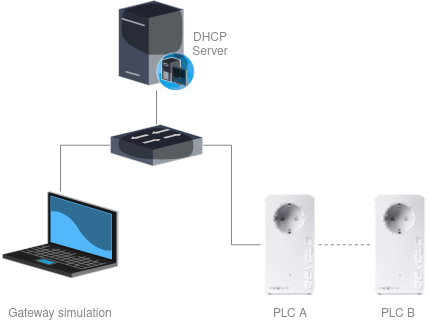
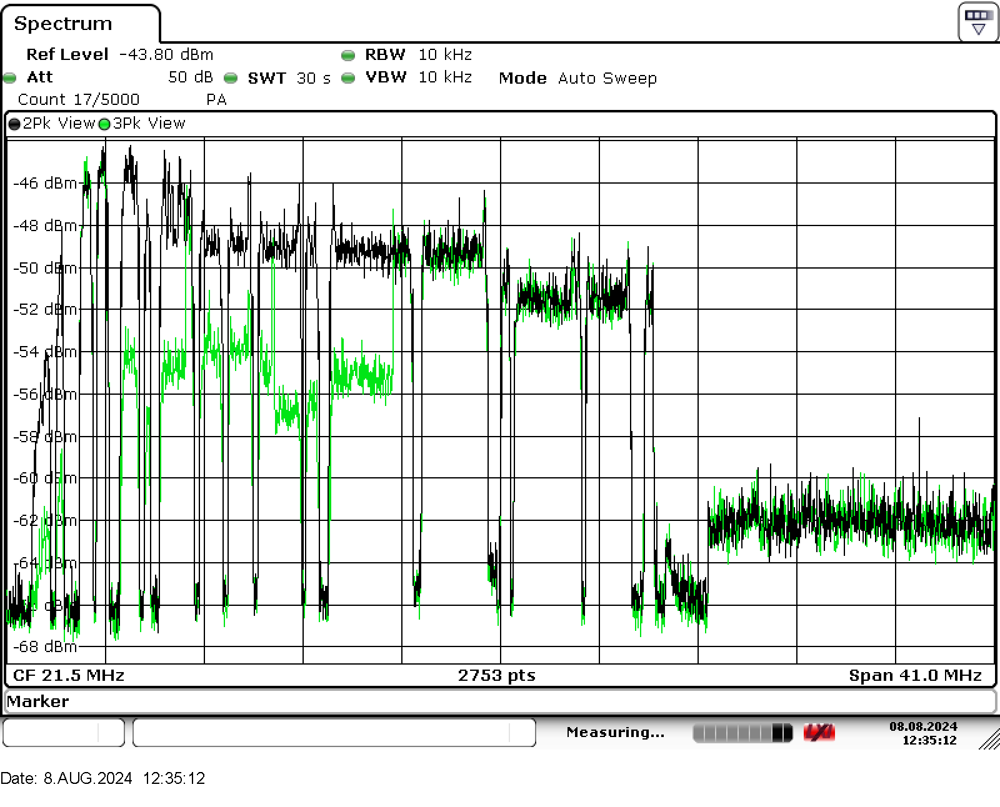
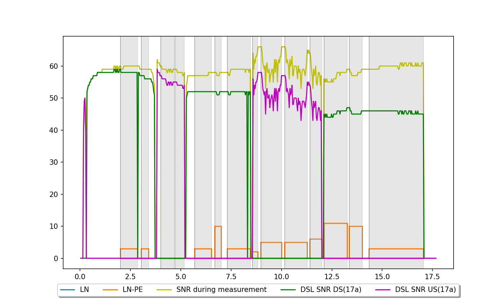

# gwsim

## Description

Simulates a gateway supporting the server side of the [VDSL Performer](../README.md) protocol to obtain DSL SNR for DSL coexistence tests. devolo Magic devices utilize the TR-064 issue 2 standard to fetch data from a discovered DSL gateway, aiming to eliminate interference between PLC and DSL while maximizing the available throughput on PLC.

Note: This simulation statically delivers disturbed DSL SNR values, causing the PLC device to reduce its transmit power to its defined minimum.

## Usage

```bash
usage: gwsim.py [-h] [-r RSP_FILE] [-s SNR_FILE] ip_addr

positional arguments:
  ip_addr      Local IP address of gateway simulator.

options:
  -h, --help   show this help message and exit
  -r RSP_FILE  File with responses to use (default rsp_generic.py).
  -s SNR_FILE  File with SNR values to use (default snr_default.py).
```

The value of `ip_addr` will be used in the responses to discovery. A client will need to use this IP address subsequently to fetch values using SOAP.
Ensure that the IP address assigned to the computer running the simulation falls within the same IP address range as the test devices. You can verify or select an appropriate IP address by using the command `ip addr show`.

## Test setup
The gateway simulation allows a computer to be discoverable by devolo Magic devices via SSDP and respond to their SOAP requests. However, it does not include a DHCP server. Therefore, the easiest way to create a test setup is to utilize an existing DHCP server, such as one provided by a residential gateway. Connect the computer and two Magic devices to the same network, for example, through a switch.



## Files

### Generic

`rsp_generic.py` defines the responses to simulate a gateway that follows the specification [VDSL Performer](https://github.com/devolo/vdsl-performer-documentation/blob/main/README.md).

- SSDP Response to SSDP Discovery
- HTTP Response including the UPnP XML description
- SOAP Response to SOAP Action GetSupportedDataModel
- SOAP Response to SOAP Action GetSupportedParameters
- SOAP Response to SOAP Action GetValues

This file can be edited to change:

- DSL profile (CurrentProfile)
- Max. DSL bit rates (DownstreamMaxBitRate, UpstreamMaxBitRate)
- DSL Noise Margins (DownstreamNoiseMargin, UpstreamNoiseMargin)
- Current DSL rates (DownstreamCurrRate, UpstreamCurrRate)
- SNR Group size
- and more ...

### Speedport

`rsp_speedport.py` defines the responses to simulate a Telekom Speedport gateway.

### SNR Values

`snr_default.py` defines the DSL SNR (Signal-to-noise ratio) values used by the simulation in its responses to GetValues requests. These values are served statically. The number of items depends on the selected profile (its maximum frequency and number of carriers) and the respective group size for down- and upstream.

The SNR values adhere to the format specified in [TR-181 Issue 2](https://cwmp-data-models.broadband-forum.org/tr-181-2-0-0.html#D.Device:2.Device.DSL.Diagnostics.ADSLLineTest.SNRpsds).


## Example
The spectrum analyzer image below illustrates the received SNR of a Power Line Communication (PLC) device. The black line represents the SNR without interference mitigation, while the green line shows a reduced SNR to mitigate interference with DSL signals.



The image below shows the SNR of a DSL connection using profile 17a in various states: undisturbed DSL upstream and downstream SNR, as well as the SNR during interference measurement for both upstream and downstream. It also highlights the power reductions applied to the transmitted signals of the PLC device, separately for the LN and LN-PE paths.


